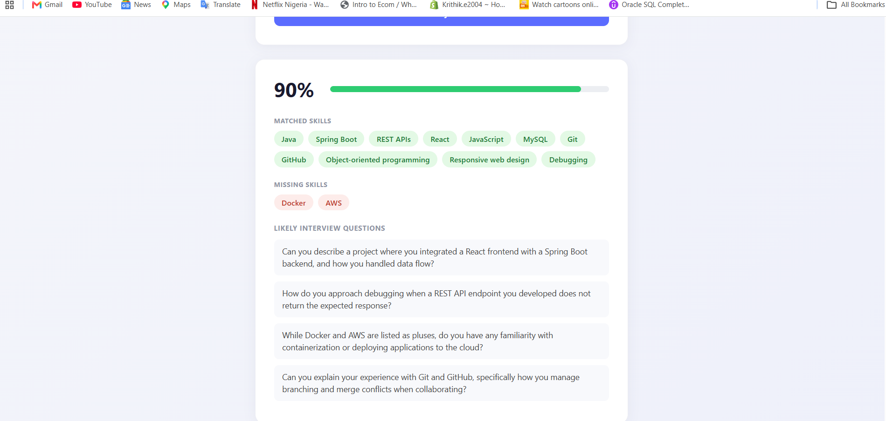

# AI Resume Matcher

An AI-powered tool that compares a resume against a job description, scores the match, highlights matched/missing skills, and generates likely interview questions — powered by the Gemini API.

🔗 **Live demo:** https://resume-matcher-red.vercel.app
📦 **Backend API:** https://resume-matcher-hl2r.onrender.com



## Features

- Paste in a resume and job description, get instant analysis
- Match score with visual indicator
- Matched vs. missing skills, shown as tags
- AI-generated interview questions tailored to the role
- Clean, responsive UI

## Tech Stack

**Frontend:** React (Vite), plain CSS
**Backend:** Java, Spring Boot, Maven
**AI:** Google Gemini API (gemini-2.5-flash)
**Deployment:** Vercel (frontend), Render + Docker (backend)

## How it works

1. User submits resume text and a job description via the React frontend
2. Spring Boot backend builds a structured prompt and calls the Gemini API
3. Gemini returns a JSON response with the match score, skill breakdown, and interview questions
4. Frontend renders the results

## Running locally

**Backend:**
```bash
cd resumematcher
$env:GEMINI_API_KEY="your-key-here"
./mvnw spring-boot:run
```

**Frontend:**
```bash
cd frontend
npm install
npm run dev
```

## Notes

This is Project 1 of a 3-project portfolio built to prepare for Summer 2027 software engineering internship applications.

---
Built by [Krithik](https://github.com/Krithikezhil)